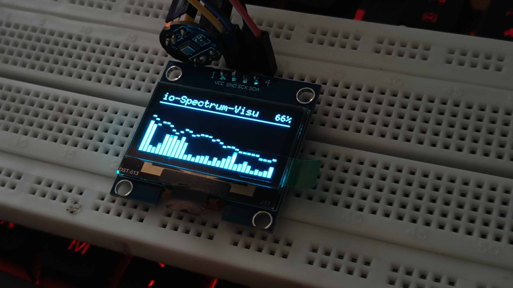
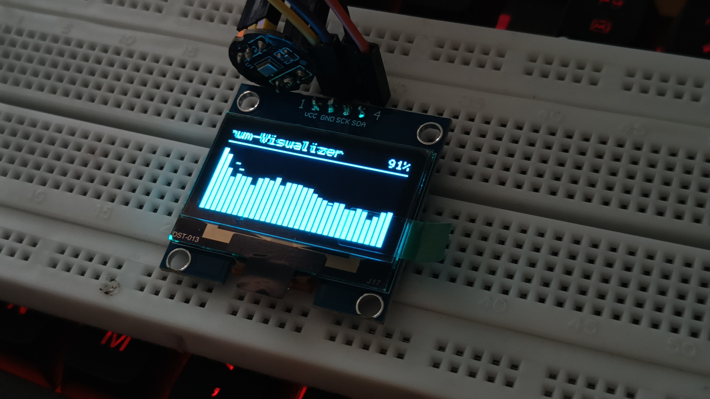
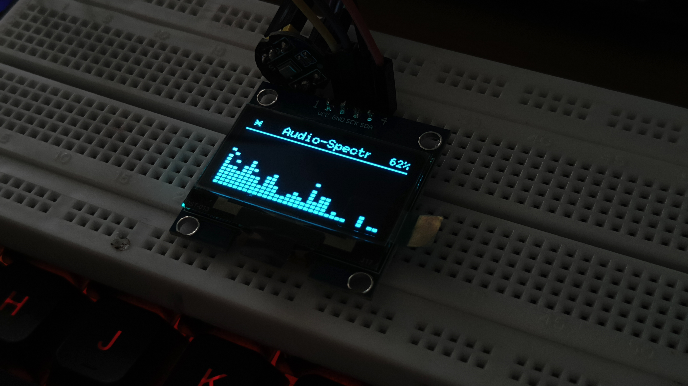
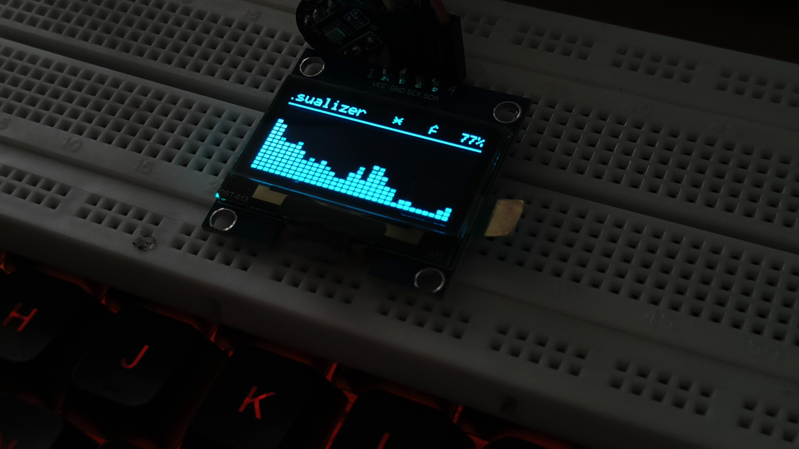
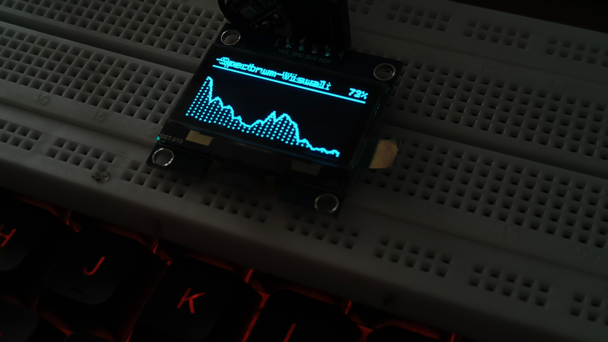
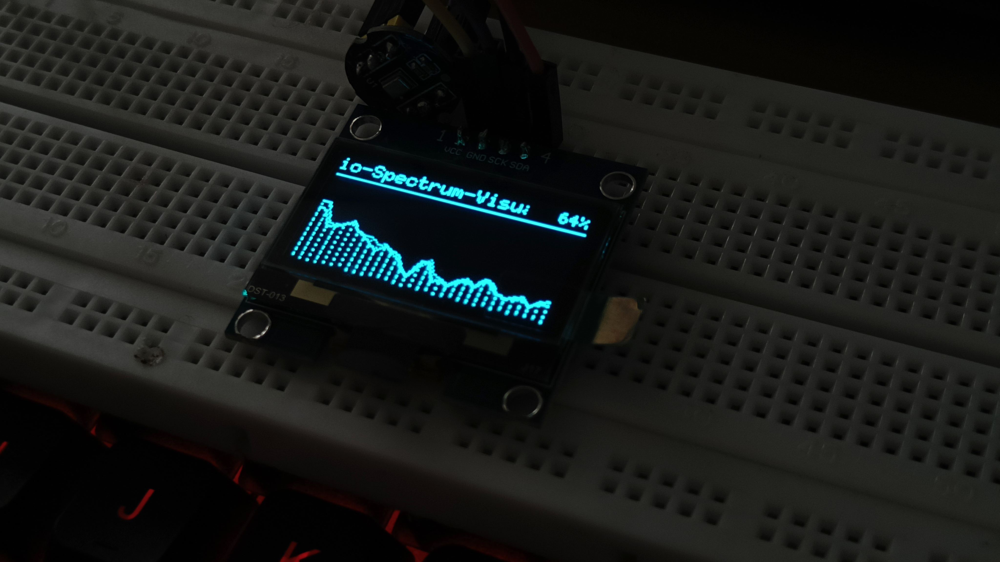
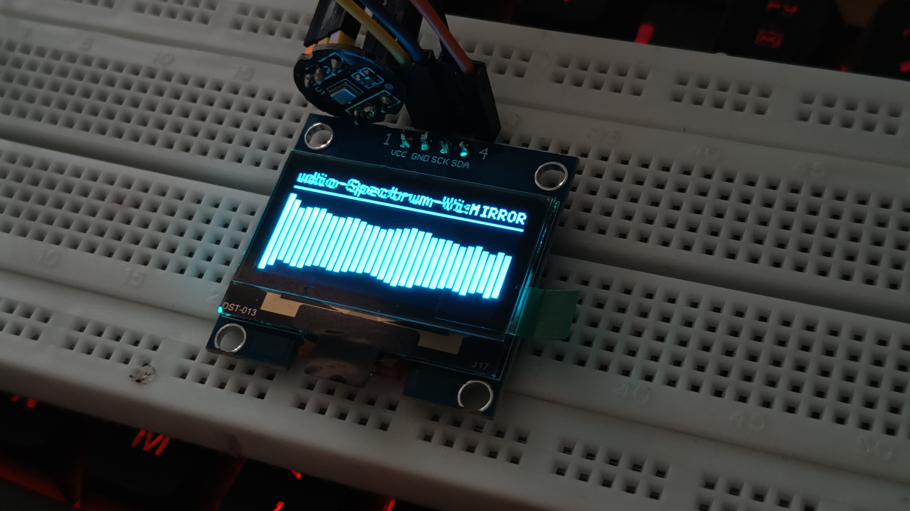
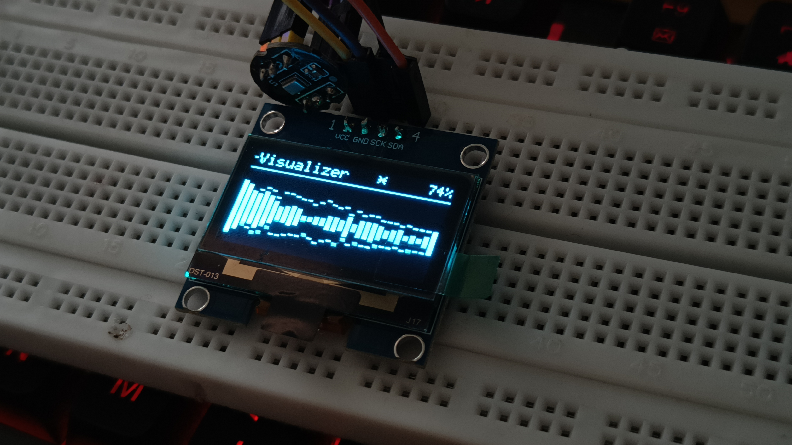

# ESP32-C3 I2S Audio Spectrum Visualizer

A mono audio spectrum visualizer for an ESP32-C3, an INMP441 I2S digital microphone, and a 128 x 64 SH1106 I2C OLED. It samples audio at 16 kHz, calculates a 512-point FFT, groups the spectrum into 32 logarithmically spaced bands, and draws one of four visualizations.

Suggested GitHub repository name: `esp32-c3-i2s-audio-spectrum-visualizer`.

> **Amplifier note:** The microphone listens to sound in the room. This project does not measure amplifier electrical output or control amplifier power. Do not connect a speaker output, especially a high-power amplifier output, to the INMP441 or ESP32. Place the microphone near the speaker at a sensible listening level and tune the display in software.

## Features

- INMP441 digital microphone input over I2S.
- 16 kHz sample rate and 512 samples per FFT frame (31.25 Hz bin spacing).
- Per-frequency idle-noise calibration at startup and on demand.
- 32 log-spaced spectrum bars with noise-floor subtraction.
- Four OLED modes: `BARS`, `MIRROR`, `LED`, and `LINE`.
- Automatic mode cycling, peak markers, smoothing, and a quiet-state animation.
- Serial Monitor controls for mode, sensitivity, recalibration, and scrolling text.

## Output Gallery

Photos of the four display modes running on the OLED:

### Bar Spectrum

<p align="center">
        
        
</p>

### Segmented LED

<p align="center">
        
        
</p>

### Line Spectrum

<p align="center">
        
        
</p>

### Mirrored Spectrum

<p align="center">
        
        
</p>

## Hardware

- ESP32-C3 development board (the pin map below is the one in the sketch).
- INMP441 I2S microphone breakout.
- 128 x 64 I2C OLED using the SH1106 controller. The sketch instantiates the U8g2 SH1106 driver; an SSD1306-only display may not work correctly without changing that driver declaration.
- Jumper wires and a stable 3.3 V supply.

The code's comments also refer to ESP32 generally, but the pinout and target named in the sketch are for an ESP32-C3. Other ESP32 boards may use different available pins, I2S support, or board settings; adjust and verify the configuration for the exact board.

## Wiring

| Module | Pin | ESP32-C3 connection |
| --- | --- | --- |
| INMP441 | VDD | 3.3 V |
| INMP441 | GND | GND |
| INMP441 | SCK / BCLK | GPIO3 |
| INMP441 | WS / LRCL | GPIO2 |
| INMP441 | SD / DOUT | GPIO4 |
| INMP441 | L/R | GND (selects the left I2S slot) |
| OLED | VCC | 3.3 V, if supported by the module |
| OLED | GND | GND |
| OLED | SDA | GPIO8 |
| OLED | SCL | GPIO9 |

Connect the ESP32, microphone, and OLED grounds together. Keep the microphone's I2S data connection digital; it is not an analog microphone input. Check the pin labels and voltage requirements for your particular breakout boards. GPIO2, GPIO8, and GPIO9 can have boot-strapping roles on ESP32-C3 variants, so check your board schematic if attached modules prevent booting.

### Connection overview

```text
Room sound from speaker
        ~~~ acoustic sound ~~~>
INMP441 -- I2S (GPIO2, GPIO3, GPIO4) --> ESP32-C3
                                             |
                                  I2C (GPIO8, GPIO9)
                                             |
                                      SH1106 OLED

Amplifier speaker output --> speaker
                           (no electrical connection to the ESP32/mic)
```

## Arduino IDE setup

1. Install the Arduino IDE and the Espressif **esp32** board package using Boards Manager.
2. Install these libraries using Library Manager:
   - **U8g2** by olikraus.
   - **arduinoFFT**, version 2.x. The sketch uses the 2.x `ArduinoFFT<float>` API.
        - **Preferences** is included with the ESP32 Arduino core; no separate library install is needed.
3. Open `ESP32_AudioFFTMono/ESP32_AudioFFTMono.ino`. Keep the other `.ino` tabs in the same folder; Arduino compiles them as one sketch.
4. Select the board matching your hardware. For the board noted in the sketch, select **ESP32C3 Dev Module**. Enable **USB CDC On Boot** if you use the native USB serial port and the option is available for your board.
5. Select the correct port, upload, then open Serial Monitor at **115200 baud**. A line ending is useful for the `t` text command.
6. Keep the room quiet while the startup calibration runs. The OLED displays `Calibrating... keep it quiet`.

The source uses the ESP32 Arduino I2S driver API in `driver/i2s.h`. If a newer board package reports I2S API compatibility errors, use a compatible ESP32 Arduino core version or update the I2S setup code for that core; do not change the FFT or display settings to work around a driver error.

## Startup and calibration

At startup the sketch initializes I2S and the OLED, then calls `calibrateNoise()`. Calibration discards 15 frames while the microphone settles and measures 60 frames. At 16 kHz with 512 samples per frame, the measurement is about 1.9 seconds, plus the discarded frames and processing time.

For each FFT bin, the code records the mean idle magnitude and its variation. It sets that bin's noise floor to:

```text
noise floor = mean idle magnitude + NOISE_K * standard deviation
```

The default `NOISE_K` is `2.5`. During normal display updates, the measured floor is subtracted from each bin before it contributes to a bar. This helps suppress steady room/electrical noise; it is not an automatic gain control and does not permanently save a calibration to the board. A new boot recalibrates from scratch.

For a useful calibration:

1. Put the microphone where it will normally be used, and leave the OLED and other electronics powered as they will be during normal operation.
2. Set the amplifier to the intended listening configuration, but keep the room quiet during measurement. Calibration measures the microphone's idle environment, not the music.
3. Send `c` in Serial Monitor to recalibrate after changing microphone placement, gain/noise conditions, or the operating setup. Wait quietly until calibration completes.
4. Check the displayed idle behavior, then play typical audio and tune the display range if needed.

If the room cannot be made quiet, the calibration will treat ambient sound as noise and subtract more of it. Recalibrate when the audio is stopped, not while music is playing.

## Tuning it for your setup

The example settings are a starting point for the author's microphone/room/amplifier arrangement. They do not depend on an amplifier's rated wattage: a 200 W amplifier can produce many different acoustic levels depending on its volume, speaker, distance, room, and source. The INMP441 responds to sound pressure at the mic, so tune it in the actual placement and at the intended listening level.

### Sensitivity and display range

In `SpectrumDisplay.ino`, the default range is:

```cpp
float dbLow  = 20.0f;  // 0% bar level
float dbHigh = 70.0f;  // 100% bar level
```

These are relative values calculated from the FFT magnitudes, not calibrated dB SPL readings and not amplifier power measurements. The displayed `peak ... dB` serial message is relative to this signal-processing scale.

- Bars barely move during normal listening: lower both bounds. Serial `+` does this in 2-unit steps.
- Bars are nearly full most of the time: raise both bounds. Serial `-` does this in 2-unit steps.
- Bars are too jumpy at idle: recalibrate in a quiet room with `c`; if needed, increase `NOISE_K` in `FFT.ino` to subtract a more conservative noise floor.
- Quiet details disappear: lower `NOISE_K` slightly, or lower `dbLow`. Lowering `NOISE_K` can also make idle flicker more visible.
- Typical music is responsive but loud passages hit full scale: raise `dbHigh` in the source while keeping `dbLow` at the desired quiet-signal threshold. The `+` and `-` commands shift both limits together, preserving the range width.

Sensitivity changes made with `+` and `-` are saved in ESP32 non-volatile storage and survive a reboot. The source values above are used when no saved values exist. If you need a precise range, adjust both values in `SpectrumDisplay.ino` before first boot, or use the serial controls to shift the range in 2-unit steps; a previously saved range takes precedence over changed source defaults.

### Other useful source settings

| Setting | File | What it changes |
| --- | --- | --- |
| `SAMPLE_RATE` | `ESP32_AudioFFTMono.ino` | Sampling rate; impacts the frequency range and bin spacing. Keep compatible with the microphone and I2S configuration. |
| `SAMPLE_BUFFER_SIZE` | `ESP32_AudioFFTMono.ino` | FFT frame size; changing it affects frequency resolution and requires reviewing dependent arrays and band calculations. |
| `CAL_SKIP` | `FFT.ino` | Number of settling frames discarded before calibration. |
| `CAL_FRAMES` | `FFT.ino` | Number of frames used to estimate idle noise; more frames take longer but average over more samples. |
| `NOISE_K` | `FFT.ino` | Multiplier for per-bin noise variation; higher suppresses more low-level signal/noise. |
| `I2S_MIC_CHANNEL` | `MicrophoneIn.ino` | Selected microphone I2S slot. With L/R grounded, the code selects left; if input is flat, try `I2S_CHANNEL_FMT_ONLY_RIGHT`. |
| `NUM_BARS` | `SpectrumDisplay.ino` | Number of displayed spectrum bands. Current layout uses 32 bars. |
| `dbLow`, `dbHigh` | `SpectrumDisplay.ino` | Map relative FFT level to the bottom and top of the bars. |
| `DEAD_ZONE` | `SpectrumDisplay.ino` | Small low-level region suppressed to reduce idle flicker. |
| `RISE`, `FALL` | `SpectrumDisplay.ino` | Bar attack and decay smoothing; higher values respond faster. |
| `PEAK_DROP` | `SpectrumDisplay.ino` | Rate at which peak markers fall. |
| `ACTIVE_PCT`, `IDLE_MS` | `SpectrumDisplay.ino` | Activity threshold and silence duration before the idle animation. |
| `AUTO_CYCLE_MS` | `SpectrumDisplay.ino` | Automatic visualization-mode interval when auto mode is enabled; set to `0` to disable timed cycling. |
| `MARQUEE_SPEED` | `SpectrumDisplay.ino` | Scrolling header text speed. |

The current code uses 32 bars, each 3 pixels wide with a 1-pixel gap, to fit the 128-pixel display. If you change `NUM_BARS`, make sure `NUM_BARS * BAR_STEP` remains at most 128 and inspect the log-band bin boundaries.

## Serial Monitor commands

Set Serial Monitor to **115200 baud**.

| Input | Action |
| --- | --- |
| `m` | Advance to the next visualization mode, switch to manual mode, and keep that mode selected. |
| `a` | Toggle automatic mode cycling on/off. When enabled, the mode advances every 20 seconds by default. |
| `+` | Increase sensitivity by moving both range limits down by 2. |
| `-` | Decrease sensitivity by moving both range limits up by 2. |
| `c` | Re-measure the idle noise floor; keep the environment quiet. |
| `tYour text` | Replace the scrolling header text, for example `tNow playing: Song - Artist`. Send a newline after the text; up to 80 characters are kept. |

The default is manual mode. Press `m` to advance to the next mode and stay there; each `m` press advances once and remains manual. Press `a` to toggle timed automatic cycling. The last selected mode, auto/manual state, sensitivity range, and custom scrolling text are saved in ESP32 non-volatile storage and restored after power loss. Auto mode resumes after reboot from the last manually selected mode. Noise calibration is intentionally repeated at every boot because the microphone's idle environment may have changed; `c` recalibrates it immediately.

## How the display is produced

1. I2S reads 512 32-bit slots from the INMP441. The sketch shifts each sample to retain its upper sample bits.
2. The sample mean is removed to reduce DC offset, the values are scaled, and a Hamming window is applied.
3. `arduinoFFT` computes the spectrum and converts the complex output to magnitude.
4. The code groups bins logarithmically into 32 bands, subtracts the calibrated per-bin noise floor, and applies a small treble tilt.
5. Relative magnitudes are mapped through `dbLow`/`dbHigh`, then smoothed and rendered on the OLED.

The microphone is mono; the four display modes are visual styles, not separate audio channels.

## Troubleshooting

- **OLED stays blank:** Confirm the display is SH1106, check 3.3 V/GND and SDA GPIO8/SCL GPIO9, and verify the selected board's GPIO assignments.
- **Microphone reads flat or has no signal:** Check VDD/GND, SCK GPIO3, WS GPIO2, SD GPIO4, and L/R. Try changing `I2S_MIC_CHANNEL` from left to right if the module's channel selection differs.
- **ESP32-C3 will not boot with modules attached:** Review the board's boot-strapping pin requirements, especially GPIO2, GPIO8, and GPIO9, and disconnect external circuitry while testing.
- **Idle bars flicker:** Keep the mic quiet during calibration, use `c` after stabilizing the setup, increase `NOISE_K` slightly, or increase `DEAD_ZONE` slightly.
- **Music does not reach the top:** Lower the range with `+`, or edit the range defaults. Confirm the microphone is close enough and not obstructed.
- **Bars stay at maximum:** Raise `dbHigh`, reduce mic exposure by moving it farther from the speaker, or check for clipping/strong noise.
- **I2S setup errors while compiling:** Confirm the ESP32 board package and selected target. The project uses the `driver/i2s.h` driver interface.
- **Speaker/amplifier hum is present:** Keep the mic wiring away from power wiring and speaker cables, use clean 3.3 V power, and improve grounding. Never tie a speaker output to the mic or ESP32 ground/input pins.

## Project files

- `ESP32_AudioFFTMono/ESP32_AudioFFTMono.ino` - Arduino entry point, shared buffers, sample rate, and setup/loop.
- `ESP32_AudioFFTMono/MicrophoneIn.ino` - I2S microphone pins, driver setup, and sample acquisition.
- `ESP32_AudioFFTMono/FFT.ino` - FFT processing and idle-noise calibration.
- `ESP32_AudioFFTMono/SpectrumDisplay.ino` - OLED setup, serial controls, spectrum mapping, animation, and display modes.

## Repository Layout

```text
.
|-- .gitignore
|-- README.md
|-- images/
|   |-- bar1.jpeg
|   |-- bar2.jpeg
|   |-- LED1.jpeg
|   |-- LED2.jpeg
|   |-- Line1.jpeg
|   |-- Line2.jpeg
|   |-- mirror1.jpeg
|   `-- mirror2.jpeg
`-- ESP32_AudioFFTMono/
        |-- ESP32_AudioFFTMono.ino
        |-- FFT.ino
        |-- MicrophoneIn.ino
        `-- SpectrumDisplay.ino
```

The sketch folder name matches the primary `.ino` filename, so Arduino IDE can open it as a complete sketch after cloning the repository. `.gitignore` excludes generated build artifacts while keeping the source and output photos tracked.

## License

This project is licensed under the MIT License. See [LICENSE](LICENSE) for the full text.
